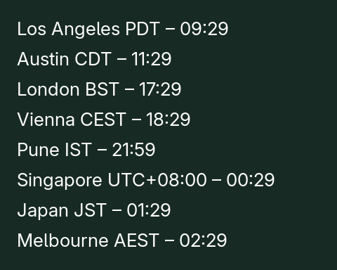
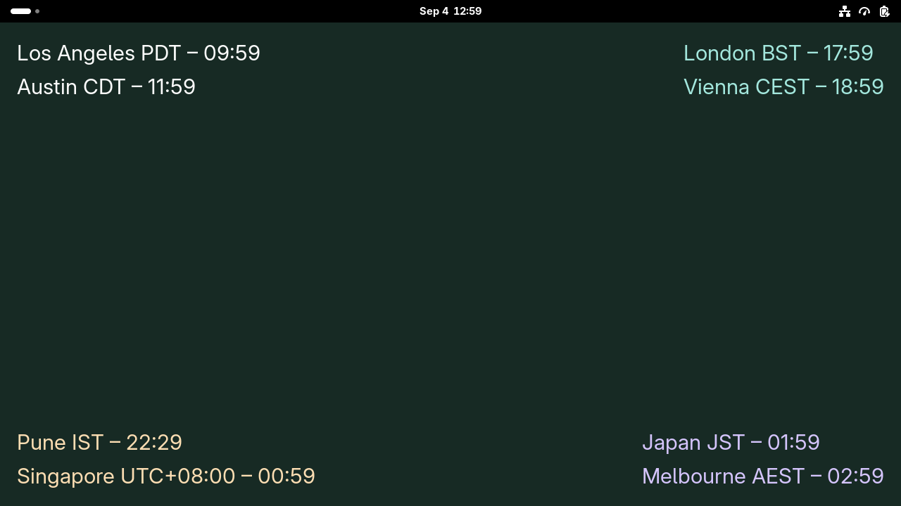
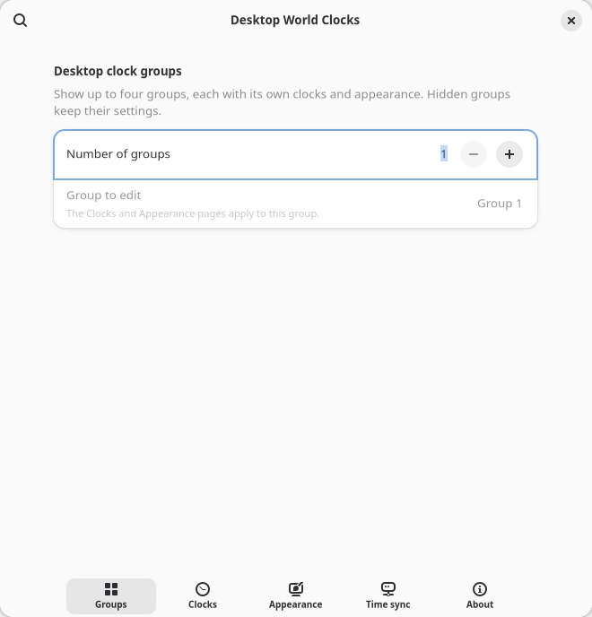

# Desktop World Clocks

Up to four independent groups of world clocks directly on the GNOME desktop, above the wallpaper and below application windows. Each group supports up to ten clocks (40 total).

**Development build. Targets GNOME Shell 49, 50, and 51.** Version declarations are in `metadata.json`; runtime testing is recorded separately:

| GNOME Shell | Compatibility status |
| --- | --- |
| 49 | Core suite passed on **49.9** in an isolated Fedora 43 container; image and physical-session checks pending |
| 50 | Tested on Fedora 44 with GNOME Shell **50.4**, in an isolated Wayland session |
| 51 | Core suite passed on **51.beta** in an isolated Fedora development container; image, physical-session, and final-release checks pending |

The core suite exercises real Shell and native preferences, including layouts, timers, colors, clock editing, and cleanup. Container image tests are excluded because the nested image-decoder sandbox cannot run under this host’s container restrictions. Full compatibility is not yet verified on GNOME 49 and 51. See [validation and remaining checks](docs/DEVELOPMENT.md).



Native desktop detail, shown with text shadow disabled for clarity. [View the full desktop screenshot](docs/desktop.png).

## Features

- Show one to four independent clock groups, each with its own clocks, corner, monitor, fonts, colors, opacity, layout, background, and time format.

- Choose from the installed IANA time-zone database, including aliases and UTC. Duplicate zones with different labels are supported.
- Add, remove, and reorder up to ten clocks per group. A blank description uses the selected location name, such as `America/New_York` → `New York`.
- Pick any font family available to GNOME using its native font chooser. Set font size, text opacity, global color, and individual clock color overrides.
- Hide the time-zone abbreviation per clock, or hide all abbreviations with the global switch. Abbreviations follow daylight-saving rules; numeric zone names display as UTC offsets.
- Five layouts: inline, aligned time column, large time with label above, two-column grid, and a wrapping horizontal strip.
- Four corner positions, monitor selection, edge margin, 12/24-hour time, optional seconds, optional date difference, and text shadow.
- Transparent, solid-color, or local-image backgrounds for the clock group. Text opacity is independent of the background. Images use centered cover cropping.
- An [About tab](docs/about.png) shows the license, build information, GNOME targets, GitHub repository, issue tracker, and time/privacy details.

Each clock group shrinks to fit when the selected font, labels, and clock count exceed the available desktop space. Grid and strip layouts adapt to monitor width. Monitor `−1` follows the primary monitor; nonnegative values select a monitor by its current index. A disconnected selection falls back to the primary monitor.

## Clocks in every corner

Open **Groups**, set **Number of groups** to 4, and use **Group to edit** to choose which group the **Clocks** and **Appearance** pages configure. Group 1 preserves your existing clocks and settings. New groups start with one UTC clock in the top-right, bottom-left, and bottom-right corners; customize their clocks as needed. Each group’s corner and monitor can be changed in Appearance.

Reducing the count hides the higher-numbered groups and retains their settings. Increasing it restores them. Large groups can overlap on small screens; reduce font size or clock count, or choose another layout or monitor.



## Time synchronization and resource use

All clocks read the same **existing system clock**. The operating system's time service (for example, Fedora's chrony) handles synchronization and NTP source selection. The extension does not choose or guarantee the closest server, install a service, request administrator access, or run its own NTP client. Configure nearby pool or local NTP sources through the system's existing administration tools.

Preferences show the system-reported synchronization status, with a manual refresh and an **Open Date & Time** button. Status can be unavailable on systems without the standard time-status service; clocks continue displaying system time. No server, offset, accuracy, or last-sync measurements are invented.

The desktop component has one shared timer, aligned to minute boundaries by default. The same timer serves all four groups. If any visible group shows seconds, it wakes once per second, while minute-only groups skip formatting until the minute changes. It caches up to ten zone objects per group (40 total), reuses clock widgets, and changes text only when needed. It pauses updates in Overview and during suspend. Groups on a monitor with a full-screen application pause independently. Empty or hidden groups consume no clock timer; hidden groups release their desktop actors. Disabling the extension removes its timer, signals, D-Bus subscription, and actors. The desktop component starts no web view, network polling, telemetry, helper process, or Node.js runtime. Native preferences may use the operating system’s own image-decoder and portal services.

The native preferences process loads fonts and the time-zone list only when needed. Selected PNG/JPG/WebP images must be local regular files and at most 10 MB; bounded reads and raster-signature checks enforce that limit before decoding; preferences prepare a copy no larger than 2048 × 2048 pixels in `$XDG_DATA_HOME/desktop-world-clocks` (normally `~/.local/share/desktop-world-clocks`). Replacing a group’s image removes its previous managed copy if no other group references it. The original stays untouched. Missing images render without an image and can be replaced in preferences.

These are implemented resource controls, not measured CPU or memory guarantees. Leave seconds off and use a transparent background for the lowest update and image-memory cost.



## Build and install

Requires GNOME Shell 49–51, GJS, GTK 4.20 or later, libadwaita 1.8 or later, GLib, the system `tzdata` package with `/usr/share/zoneinfo/tzdata.zi`, and the GNOME Extensions command-line tool. Packaging additionally requires Python 3 and `glib-compile-schemas`. Normal GNOME installations supply the runtime libraries; Node.js is only used for development linting.

From this repository:

```sh
python3 scripts/package.py
gnome-extensions install --force dist/desktop-world-clocks@infamous-pattern.github.io.shell-extension.zip
```

On Wayland, log out and back in after the first installation or a code update. Then enable and configure:

```sh
gnome-extensions enable desktop-world-clocks@infamous-pattern.github.io
gnome-extensions prefs desktop-world-clocks@infamous-pattern.github.io
```

You can also enable it and open preferences through the GNOME Extensions app. Version validation should remain enabled. Clocks are click-through and configured from preferences. They are not displayed on the lock screen.

To stop or uninstall:

```sh
gnome-extensions disable desktop-world-clocks@infamous-pattern.github.io
gnome-extensions uninstall desktop-world-clocks@infamous-pattern.github.io
```

Uninstalling leaves saved preferences and the managed image available for a future installation.

## GNOME review preparation

See the [submission checklist and maintainer walkthrough](docs/GNOME-SUBMISSION.md). Code, packaging, and security checks are prepared; maintainer review, public support access, and the outstanding version/session tests remain before upload.

## Security review

An [initial security review](docs/SECURITY-REVIEW.md) records dependency and secret-scan results, targeted input checks, and remaining hardening work. It is not an independent security audit.

## Development

```sh
npm ci
npm run lint
npm test
npm run test:security
python3 scripts/test-shell.py
npm run pack
```

The Shell test creates a disposable software-rendered Wayland session with separate settings and data directories; it does not install into or alter the active desktop. See [development notes](docs/DEVELOPMENT.md) for test requirements and scope.

The implementation follows the [GNOME Extension Developer Guide](https://gjs.guide/extensions/), including synchronous lifecycle cleanup, separate Shell and GTK processes, modern ES modules, GSettings, cancellable preferences I/O, and a runtime-only distribution. It has not been reviewed or approved by extensions.gnome.org. The source includes the guide's required AI-generation notice; a maintainer must understand and maintain the code before any submission there.

The approved browser concept remains in [design/preview.html](design/preview.html); its time-source controls are historical mockups. The actual extension uses the existing system service as selected during implementation. See [design decisions](design/DESIGN.md).

License: GPL-2.0-or-later. See [LICENSE](LICENSE).
